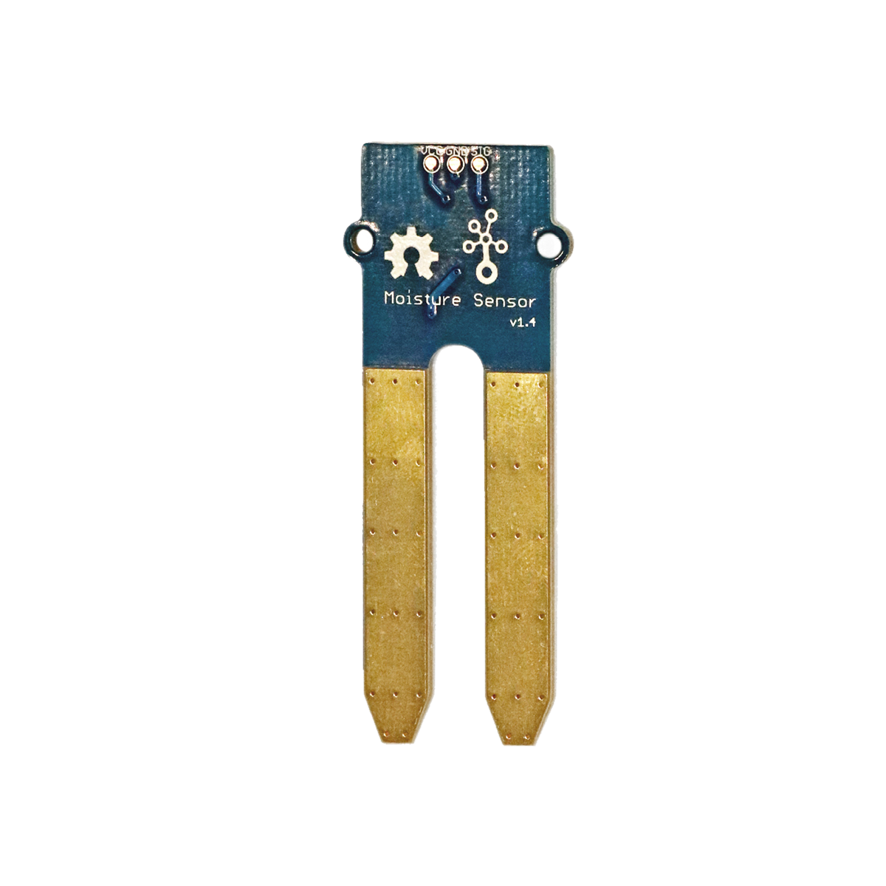

# Bodenfeuchtigkeitssensor

## Beschreibung
Der Feuchtigkeitssensor kann die Bodenfeuchtigkeit messen oder erkennen, ob er sich in Wasser befindet. Mithilfe des Grove Shields oder auch direkt kann der Sensor an einen Arduino angeschlossen werden. Er gibt über den analogen Ausgang die Bodenfeuchtigkeit an. Die Skala reicht hier von 0 (trocken) bis 900 (komplett in Wasser stehend).

Hiermit können jegliche Projekte mit einer automatischen Bewässerungsanlage realisiert werden.

Alle weiteren Hintergrundinformationen sowie ein Beispielaufbau und notwendigen Programmbibliotheken sind auf dem offiziellen Wiki (bisher nur in englischer Sprache) von Seeed Studio zusammengefasst. Zusätzlich findet man über alle gängigen Suchmaschinen durch die Eingabe der genauen Komponentenbezeichnung entsprechende Projektbeispiele und Tutorials.

## Beispiele

!!!show-examples:./examples/

<!-- infolist -->

## Wichtige Links für die ersten Schritte:

- [Seeed Studio Wiki](http://wiki.seeedstudio.com/Grove-Moisture_Sensor/) [\-Bodenfeuchtigkeitssensor](http://wiki.seeedstudio.com/Grove-Moisture_Sensor/)

## Projektbeispiele:

- [Funduino Beispiele](https://funduino.de/nr-16-feuchtigkeitssensor)

## Weiterführende Hintergrundinformationen:

- [GPIO - Wikipedia Artikel](https://de.wikipedia.org/wiki/Allzweckeingabe/-ausgabe)
- [GitHub-Repository: Bodenfeuchtigkeitssensor](https://github.com/MakeYourSchool/10-Bodenfeuchtigkeitssensor)

